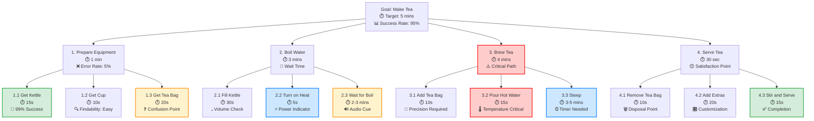

```mermaid
flowchart TD
    A["Goal: Make Tea<br/>⏱️ Target: 5 mins<br/>📊 Success Rate: 95%"] --> B["1. Prepare Equipment<br/>⏱️ 1 min<br/>❌ Error Rate: 5%"]
    A --> C["2. Boil Water<br/>⏱️ 3 mins<br/>🔄 Wait Time"]
    A --> D["3. Brew Tea<br/>⏱️ 4 mins<br/>⚠️ Critical Path"]
    A --> E["4. Serve Tea<br/>⏱️ 30 sec<br/>😊 Satisfaction Point"]
    
    B --> B1["1.1 Get Kettle<br/>⏱️ 15s<br/>🎯 99% Success"]
    B --> B2["1.2 Get Cup<br/>⏱️ 10s<br/>🔍 Findability: Easy"]
    B --> B3["1.3 Get Tea Bag<br/>⏱️ 20s<br/>❓ Confusion Point"]
    
    C --> C1["2.1 Fill Kettle<br/>⏱️ 30s<br/>💧 Volume Check"]
    C --> C2["2.2 Turn on Heat<br/>⏱️ 5s<br/>⚡ Power Indicator"]
    C --> C3["2.3 Wait for Boil<br/>⏱️ 2-3 mins<br/>🔊 Audio Cue"]
    
    D --> D1["3.1 Add Tea Bag<br/>⏱️ 10s<br/>📏 Precision Required"]
    D --> D2["3.2 Pour Hot Water<br/>⏱️ 15s<br/>🌡️ Temperature Critical"]
    D --> D3["3.3 Steep<br/>⏱️ 3-5 mins<br/>⏰ Timer Needed"]
    
    E --> E1["4.1 Remove Tea Bag<br/>⏱️ 10s<br/>🗑️ Disposal Point"]
    E --> E2["4.2 Add Extras<br/>⏱️ 20s<br/>🎛️ Customization"]
    E --> E3["4.3 Stir and Serve<br/>⏱️ 15s<br/>✅ Completion"]


    %% Styling for different KPI levels
    classDef critical fill:#ffcccc,stroke:#ff0000,stroke-width:2px
    classDef warning fill:#fff3cd,stroke:#ff8800,stroke-width:2px
    classDef success fill:#d4edda,stroke:#28a745,stroke-width:2px
    classDef info fill:#cce7ff,stroke:#007bff,stroke-width:2px
    
    class D,D2 critical
    class B3,C3 warning
    class B1,E3 success
    class C2,D3 info
```