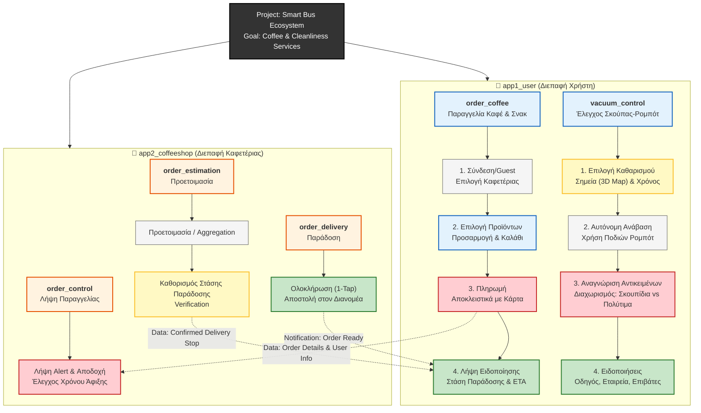

```mermaid
flowchart TD
    %% Κεντρικός Στόχος
    GOAL["Project: Smart Bus Ecosystem<br/>Goal: Coffee & Cleanliness Services"]:::main

    %% ---------------------------------------------------------
    %% APP 1: USER SIDE (Επιβάτης / Διαχειριστής)
    %% ---------------------------------------------------------
    subgraph APP1["📁 app1_user (Διεπαφή Χρήστη)"]
        direction TB
        
        %% --- Module: Order Coffee ---
        %% Βασισμένο στην εκφώνηση: Παραγγελία από συνεργαζόμενες καφετέριες [cite: 66]
        U1["<b>order_coffee</b><br/>Παραγγελία Καφέ & Σνακ"]:::userAction
        
        U1A["1. Σύνδεση/Guest<br/>Επιλογή Καφετέριας"]:::info
        U1B["2. Επιλογή Προϊόντων<br/>Προσαρμογή & Καλάθι"]:::userAction
        U1C["3. Πληρωμή<br/>Αποκλειστικά με Κάρτα"]:::critical
        U1D["4. Λήψη Ειδοποίησης<br/>Στάση Παράδοσης & ETA"]:::success

        U1 --> U1A --> U1B --> U1C --> U1D

        %% --- Module: Vacuum Control ---
        %% Βασισμένο στην εκφώνηση: Σκούπα-Ρομπότ, Πόδια, Αναγνώριση [cite: 70-74]
        U2["<b>vacuum_control</b><br/>Έλεγχος Σκούπας-Ρομπότ"]:::userAction
        
        U2A["1. Επιλογή Καθαρισμού<br/>Σημεία (3D Map) & Χρόνος"]:::warning
        U2B["2. Αυτόνομη Ανάβαση<br/>Χρήση Ποδιών Ρομπότ"]:::info
        U2C["3. Αναγνώριση Αντικειμένων<br/>Διαχωρισμός: Σκουπίδια vs Πολύτιμα"]:::critical
        U2D["4. Ειδοποιήσεις<br/>Οδηγός, Εταιρεία, Επιβάτες"]:::success

        U2 --> U2A --> U2B --> U2C --> U2D
    end

    %% ---------------------------------------------------------
    %% APP 2: COFFEE SHOP SIDE (Καφετέρια)
    %% ---------------------------------------------------------
    subgraph APP2["📁 app2_coffeeshop (Διεπαφή Καφετέριας)"]
        direction TB
        
        %% --- Module: Order Control ---
        %% Η καφετέρια λαμβάνει την εντολή 
        S1["<b>order_control</b><br/>Λήψη Παραγγελίας"]:::shopAction
        
        S1A["Λήψη Alert & Αποδοχή<br/>Έλεγχος Χρόνου Άφιξης"]:::critical

        S1 --> S1A

        %% --- Module: Order Estimation ---
        %% Ειδοποίηση για στάση παράδοσης 
        S2["<b>order_estimation</b><br/>Προετοιμασία"]:::shopAction
        
        S2A["Προετοιμασία / Aggregation"]:::info
        S2B["Καθορισμός Στάσης Παράδοσης<br/>Verification"]:::warning

        S2 --> S2A --> S2B

        %% --- Module: Order Delivery ---
        S3["<b>order_delivery</b><br/>Παράδοση"]:::shopAction
        
        S3A["Ολοκλήρωση (1-Tap)<br/>Αποστολή στον Διανομέα"]:::success

        S3 --> S3A
    end

    %% ---------------------------------------------------------
    %% ΣΥΝΔΕΣΕΙΣ (DATA FLOW)
    %% ---------------------------------------------------------
    GOAL --> APP1
    GOAL --> APP2

    %% Ροή 1: Η πληρωμή (App1) στέλνει τα δεδομένα στην καφετέρια (App2)
    U1C -.->|"Data: Order Details & User Info"| S1A

    %% Ροή 2: Η καφετέρια (App2) επιβεβαιώνει τη στάση παράδοσης στο App1 
    S2B -.->|"Data: Confirmed Delivery Stop"| U1D

    %% Ροή 3: Η ολοκλήρωση (App2) ενημερώνει τελικά τον χρήστη (App1)
    S3A -.->|"Notification: Order Ready"| U1D

    %% Styles
    classDef main fill:#333,stroke:#000,stroke-width:2px,color:#fff
    classDef userAction fill:#e3f2fd,stroke:#1565c0,stroke-width:2px
    classDef shopAction fill:#fff3e0,stroke:#e65100,stroke-width:2px
    
    classDef critical fill:#ffcdd2,stroke:#c62828,stroke-width:2px
    classDef warning fill:#fff9c4,stroke:#fbc02d,stroke-width:2px
    classDef success fill:#c8e6c9,stroke:#2e7d32,stroke-width:2px
    classDef info fill:#f5f5f5,stroke:#616161,stroke-width:1px
```
