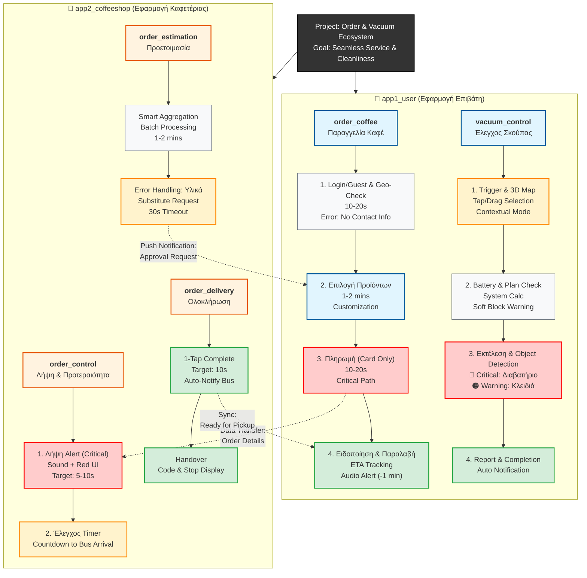

```mermaid
flowchart TD
    %% Κεντρικός Στόχος
    GOAL["Project: Order & Vacuum Ecosystem<br/>Goal: Seamless Service & Cleanliness"]:::main

    %% ---------------------------------------------------------
    %% APP 1: USER SIDE
    %% ---------------------------------------------------------
    subgraph APP1["📁 app1_user (Εφαρμογή Επιβάτη)"]
        direction TB
        
        %% --- Module: Order Coffee ---
        U1["<b>order_coffee</b><br/>Παραγγελία Καφέ"]:::userAction
        
        U1A["1. Login/Guest & Geo-Check<br/>10-20s<br/>Error: No Contact Info"]:::info
        U1B["2. Επιλογή Προϊόντων<br/>1-2 mins<br/>Customization"]:::userAction
        U1C["3. Πληρωμή (Card Only)<br/>10-20s<br/>Critical Path"]:::critical
        U1D["4. Ειδοποίηση & Παραλαβή<br/>ETA Tracking<br/>Audio Alert (-1 min)"]:::success

        U1 --> U1A --> U1B --> U1C --> U1D

        %% --- Module: Vacuum Control ---
        U2["<b>vacuum_control</b><br/>Έλεγχος Σκούπας"]:::userAction
        
        U2A["1. Trigger & 3D Map<br/>Tap/Drag Selection<br/>Contextual Mode"]:::warning
        U2B["2. Battery & Plan Check<br/>System Calc<br/>Soft Block Warning"]:::info
        U2C["3. Εκτέλεση & Object Detection<br/>🔴 Critical: Διαβατήριο<br/>🟠 Warning: Κλειδιά"]:::critical
        U2D["4. Report & Completion<br/>Auto Notification"]:::success

        U2 --> U2A --> U2B --> U2C --> U2D
    end

    %% ---------------------------------------------------------
    %% APP 2: COFFEE SHOP SIDE
    %% ---------------------------------------------------------
    subgraph APP2["📁 app2_coffeeshop (Εφαρμογή Καφετέριας)"]
        direction TB
        
        %% --- Module: Order Control ---
        S1["<b>order_control</b><br/>Λήψη & Προτεραιότητα"]:::shopAction
        
        S1A["1. Λήψη Alert (Critical)<br/>Sound + Red UI<br/>Target: 5-10s"]:::critical
        S1B["2. Έλεγχος Timer<br/>Countdown to Bus Arrival"]:::warning

        S1 --> S1A --> S1B

        %% --- Module: Order Estimation ---
        S2["<b>order_estimation</b><br/>Προετοιμασία"]:::shopAction
        
        S2A["Smart Aggregation<br/>Batch Processing<br/>1-2 mins"]:::info
        S2B["Error Handling: Υλικά<br/>Substitute Request<br/>30s Timeout"]:::warning

        S2 --> S2A --> S2B

        %% --- Module: Order Delivery ---
        S3["<b>order_delivery</b><br/>Ολοκλήρωση"]:::shopAction
        
        S3A["1-Tap Complete<br/>Target: 10s<br/>Auto-Notify Bus"]:::success
        S3B["Handover<br/>Code & Stop Display"]:::success

        S3 --> S3A --> S3B
    end

    %% ---------------------------------------------------------
    %% ΣΥΝΔΕΣΕΙΣ ΜΕΤΑΞΥ ΕΦΑΡΜΟΓΩΝ
    %% ---------------------------------------------------------
    GOAL --> APP1
    GOAL --> APP2

    %% Η Πληρωμή (App1) στέλνει την παραγγελία στο App2
    U1C -.->|"Data Transfer:<br/>Order Details"| S1A

    %% Η Αντικατάσταση Υλικού (App2) ρωτάει τον χρήστη (App1)
    S2B -.->|"Push Notification:<br/>Approval Request"| U1B

    %% Το 1-Tap Complete (App2) ενημερώνει τον χρήστη (App1)
    S3A -.->|"Sync:<br/>Ready for Pickup"| U1D

    %% Styles
    classDef main fill:#333,stroke:#000,stroke-width:2px,color:#fff
    classDef userAction fill:#e1f5fe,stroke:#01579b,stroke-width:2px
    classDef shopAction fill:#fff3e0,stroke:#e65100,stroke-width:2px
    
    classDef critical fill:#ffcccc,stroke:#ff0000,stroke-width:2px
    classDef warning fill:#fff3cd,stroke:#ff8800,stroke-width:2px
    classDef success fill:#d4edda,stroke:#28a745,stroke-width:2px
    classDef info fill:#f8f9fa,stroke:#6c757d,stroke-width:1px
```
